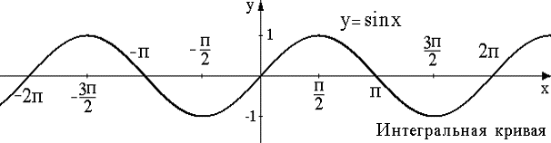

**_Определение_** 1. _Дифференциальным уравнением_ называется уравнение, связывающее между собой независимые переменные, неизвестную функцию этих переменных и ее производные (или дифференциалы).

Если неизвестная функция зависит только от одной переменной, то дифференциальное уравнение называется _обыкновенным_. Если же неизвестная функция зависит от нескольких независимых переменных, то дифференциальное уравнение называется _уравнением в частных производных_.

**_Определение_** 2. Порядком дифференциального уравнения называется наивысший порядок производной (или дифференциала) неизвестной функции, входящей в уравнение.

**Примеры.**
1) $3x^3\cdot y'+\frac{x}{y}=y^2$ – обыкновенное дифференциальное уравнение первого порядка, y = (x) – неизвестная функция;
2) $\frac{\partial^2y}{\partial x^2}+xy\frac{\partial y}{\partial x}=0\Large$ – обыкновенное дифференциальное уравнение второго порядка, y = (x) – неизвестная функция; 
3) $y'''-8y=4x^2+1$ – обыкновенное дифференциальное уравнение третьего порядка, y = (x) – неизвестная функция;
4) $F(x,y,y',...,y^n)=0$ – общий вид обыкновенного дифференциального уравнения n −го порядка, где F −известная функция своих аргументов, заданная в некоторой фиксированной области, x −независимая переменная, y = ( ) x – неизвестная функция аргумента x ; $y,y',y'',...,y^n$ −производные неизвестной функции;
5) $x \frac{\partial z }{\partial x} + y \frac{\partial z }{\partial y} = 0$ – дифференциальное уравнение в частных производных первого порядка; $z=z(x;y)$ – неизвестная функция;
6) $u_{t}^{'}=9\;\cdot\; u_{xx}^{''}$ – дифференциальное уравнение в частных производных второго порядка; $u=u(t;x)$  – неизвестная функция.

**_Замечание_:** В дифференциальное уравнение _n_ -го порядка обязательно должна входить производная (или дифференциал) _n_ - го порядка неизвестной функции, а независимые переменные, сама неизвестная функция и ее производные (или дифференциалы) порядка, ниже, чем _n_ , могут и не входить.

**_Определение_** 3 _Решением (или интегралом) дифференциального уравнения_ называется такая дифференцируемая функция, которая, будучи подставлена в дифференциальное уравнение, обращает его в тождество, т. е. равенство, верное при всех допустимых значениях переменных.

Решить, или проинтегрировать дифференциальное уравнение – значит, найти все его решения. График всякого решения дифференциального уравнения называется _интегральной кривой_.

**Примеры.**
1) функция $y=sin\;x$ есть решение обыкновенного дифференциального уравнения второго порядка:  $y'' = -y$.

Действительно, после подстановки функции $y=sin\;x$ в данное уравнение, получаем тождество: $-sin\;x \equiv sin\;x$
2) функция _y_ = 3x не является решением обыкновенного дифференциального уравнения первого порядка:
$$\frac{\partial z }{\partial x} = y + 6$$
Действительно, после подстановки ее в данное дифференциальное уравнение получим равенство: 3 = 3x + 6, которое не является тождеством, т. к. оно верно не при всех допустимых значениях переменной x , а лишь при x = −1.

Заметим, что интегрирование дифференциального уравнения в общем случае приводит к бесконечному множеству решений, отличающихся друг от друга постоянными величинами. Легко догадаться, например, что решением дифференциального уравнения первого порядка $y' = cos\;x$ является функция $y = sin\;x$, а также функции $y=sin\;x +1$ , $y=sin\;x +\sqrt{2}$, и вообще функции вида $y=sin\;x+c$ , где c – произвольная постоянная.
  
Чтобы решение дифференциального уравнения приобрело конкретный смысл, его надо подчинить некоторым дополнительным условиям.

Дифференциальное уравнение порядка _n_ в общем случае записывается в виде(1.1):
$$F(x,y,y',y'',...,y^n)=0$$
 или (1.2):
 $$y^{(n)} = f(x,y,y',y'',...,y^{n-1})$$
 если его можно разрешить относительно старшей производной.

**_Определение_** 4. Начальной задачей или задачей Коши для обыкновенного дифференциального уравнения (1.2) порядка n называется задача отыскания решения этого уравнения, удовлетворяющего так называемым начальным условиям(1.3):

  
$$y(x_0)=y_0$$
$$y'(x_0)=y'_0$$
$$y''(x_0)=y''_0$$
$$...\;...\;...\;...$$
$$y^{n-1}(x_0)=y^{n-1}_0$$
В частности, для дифференциального уравнения первого порядка $y = f(x;y)$ задача Коши состоит в отыскании его решения, которое при $x=x_0$ принимает значение $y_0$ , т. е. решение, удовлетворяющее начальному условию $y(x_0)=y_0$ . Геометрически это значит, что требуется найти интегральную кривую, проходящую через данную точку ( $x_0;y_0$ ) координатной плоскости XOY .

**_Определение_** 5. _Общим_ _решением_ дифференциального уравнения порядка _n_ называется функция
1)   Функция $\varphi(x,c_1,c_2,...,c_n)$ как функция аргумента $x$ является решением дифференциального уравнения.
2)   Каковы бы ни были начальные условия (1.3), существуют значения постоянных $c_1=c_1^0, c_2=c_2^0,...,c_n=c_n^0$ такие, что функция $\varphi(x,c_1^0,c_2^0,...,c_n^0)$ c является решением дифференциального уравнения (1.2) и удовлетворяет начальным условиям (1.3).

Общее решение дифференциального уравнения порядка n , записанное в виде:
$$Ф(x,y,с_1,с_2,...,с_n)=0$$
В частности, общим решением дифференциального уравнения первого порядка $y'=f(x;y)$ называется функция $y=\varphi(x;c)$ , содержащая одну произвольную постоянную $c$ и удовлетворяющая условиям:
 1) Функция $y=\varphi(x,c_1^0,c_2^0,...,c_n^0)$ как функция аргумента $x$ является решением дифференциального уравнения;
 2) Каково бы ни было начальное условие $y(x_0)=y_0$ , существует такое значение постоянной $c=c_0$, что функция $y=\varphi(x;c_0)$ удовлетворяет данному начальному условию.
 
**Определение 6**. Частным решением дифференциального уравнения порядка $n$ называется решение $y = \varphi(x,c_1^0,c_2^0,...,c_n^0)$ при фиксированных значениях постоянных $c_1=c_1^0, c_2=c_2^0,...,c_n=c_n^0$ . Частное решение дифференциального уравнения порядка $n$ , записанное в виде
$$Ф(x,y,c_1^0,c_2^0,...,c_n^0)=0$$
называется *частным интегралом.*

**Теорема Пикара** (*существования и единственности решения задачи Коши*) Если в уравнении (1.2) функция f , определяющая правую часть уравнения (1.2) непрерывна в некоторой окрестности начальной точки $(x_0,y_0,y_0',...y_0^{n-1})$и имеет непрерывные в этой окрестности частные производные по всем переменным, начиная со второй, то уравнение (1.2.) имеет единственное решение $y=y(x)$, удовлетворяющее начальным условиям (1.3).

Пример. Решить задачу Коши:
$$y'=2x,\; y(1)=2.$$**Решение:** Очевидно, что решение данного уравнения представляет собой семейство всех функций, первая производная которых равна $2x$ , т. е. имеет вид:
$$y=x^2+c$$ где c – произвольная постоянная.

Из начального условия $y(1)=2$ имеем: $2=1^2+c$, откуда $c=1$. Тогда частное решение, имеет вид $y_{ч.р.}=x^2+1$.

Геометрически, семейство интегральных кривых данного уравнения представляет собой семейство парабол с вершинами в точках вида (0; $c$), где c – произвольная постоянная. А графиком найденного частного решения является парабола с вершинами в точке (0;1), т.е. проходящая через точку A(1;2) (рисунок 1).**КОРРЕКЦИЯ РИСУНКА**

Наряду с начальной задачей (задачей Коши) рассматриваются так называемые *граничные* (краевые) задачи, в которых дополнительные условия на искомую функцию задаются не в одной точке, как это имеет место в начальной задаче, а на концах некоторого интервала (a;b) и разыскивается решение, определенное внутри этого интервала. Условия, задаваемые на концах интервала (a;b) , называются* граничными* (краевыми) условиями, а задача отыскания решения дифференциального уравнения, удовлетворяющего граничным условиям, называется *граничной* (краевой) задачей.

Необходимо отметить, что постановка граничной задачи имеет смысл только для уравнений порядка, выше первого. *Граничная* (краевая) задача не всегда имеет решение, а если имеет, то, чаще всего, не единственное.

**Пример.** Найти решение обыкновенного дифференциального уравнения:
$$y''=6x,$$ удовлетворяющее граничным условиям:
$$y(0)=0,\; y(1)=1.$$Решение: Интегрируя последовательно данное дифференциальное уравнение два раза, имеем:
$$y'=3x^2+c_1,$$$$y=x^3+c_1+c_2$$ – общее решение, где 1 c и 2 c – произвольные постоянные.

 Используя граничные условия, получим систему двух алгебраических уравнений относительно произвольных постоянных 1 c и 2 c , входящих в общее решение, а именно:
 
$$\begin{Bmatrix}  
0 = 0 + c_1 \ \cdot \ 0 + c_2 \\
1 = 1 + c_1 \ \cdot \ 1 + c_2
\end{Bmatrix}$$

Из полученной системы уравнений находим, что 1 c = 0, 2 c = 0, и, следовательно, искомое частное решение имеет вид:
$$y=x^3$$**Ответ.** $y(x)=x^3$ – частное решение.